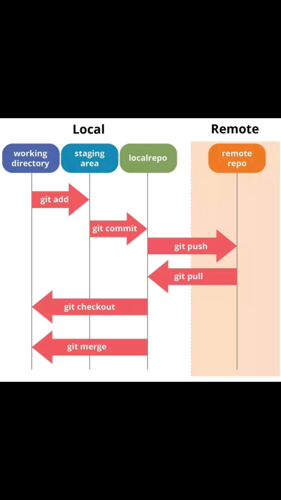

## A tutorial on using basic Git commands

Git is a version control technology that you can use to maintain shared or frequently updated files. You can use it through a GUI like GitHub or through
your command line, which is the preferred method due to efficiency.
Git is great because you can keep track of your files and others' files, restore files to previous versions, and compare solutions from different devices/members.
Here are some basic commands to git started! But first, if you've never use Git, first download it onto your computer.

### Introduce yourself
Git will want to know your user before you start working away. So clingy, I know! But it's not a committ-ed relationship or anything,
just your name.

`$ git config --global user.name "Name"`

and/or

`$ git config --global user.email "youremail@email.com"`

To view your configurations, you can use:
`$ git config --list`

### Some concepts:
Your master branch is like the tree trunk to your feature or member branches. You can branch off of the master to work on the files without
affecting what was already saved. If you feel your branch is a better version of the master, you can push your changes to the master branch.

Each member that is working on your project will have a local repository stored on their computer. This is where they work on the project and
make changes that aren't visible to other members until they want to push them to you.

This picture will help you visualize the commands being introduced, refer to it to get a better idea of how the system works:

### Make your Repository aka Folder
To create a git repo, you can easily create one on the GUI and then clone it into your local files as desired (more below).
If you create in on the GUI, just grab the repo link and run:

`$ git clone [repo url]` to have the git repo in the directory you want it to be in on your computer.

To create it in the terminal, in the appropriate directory, initialize a repo with:

`$ git init`

Whenever you want to know the status of your repo to be updates on changes, use:

`$ git status`

### Push files to your local repository

Before you push a file to a repo, you get it ready by sstaging it. To get a file in the staging area to put into your local repository, use:
`$ git add [filename]`

Git commits are little updates to inform you and your team members what has changed:
`$ git commit -m "Message about what you did"`

### Push files to your remote repository
To push a file into the remote repo for others to be able to view, use:
`$ git push -u origin master` The -u is to set pushing upstream, so next time you can just run:
`$ git push [filename]`

### Pull files from your remote repository
As files get added to the main repo, you can pull new commits and sync your local repo with the remote one with:
`git pull`

** checkout cherrypicking with git if you want more specific pulls

### Branches

A branch is like a photocopy. To create a new branch, that you can work on without affecting the current state of files:
`$ git checkout -b [name_of_your_new_branch]`

To switch to another branch:
`$ git checkout [name_of_your_next_branch]`

To push changes on your current branch to the remote repo:
`$ git push origin [name_of_your_new_branch]`

To delete that branch from the remote repo, add a colon:
`$ git push origin :[name_of_your_new_branch]`

To see all branches:
`$ git branch`

To merge your branch's changes with the master:
`$ git merge [name_of_your_branch]`
